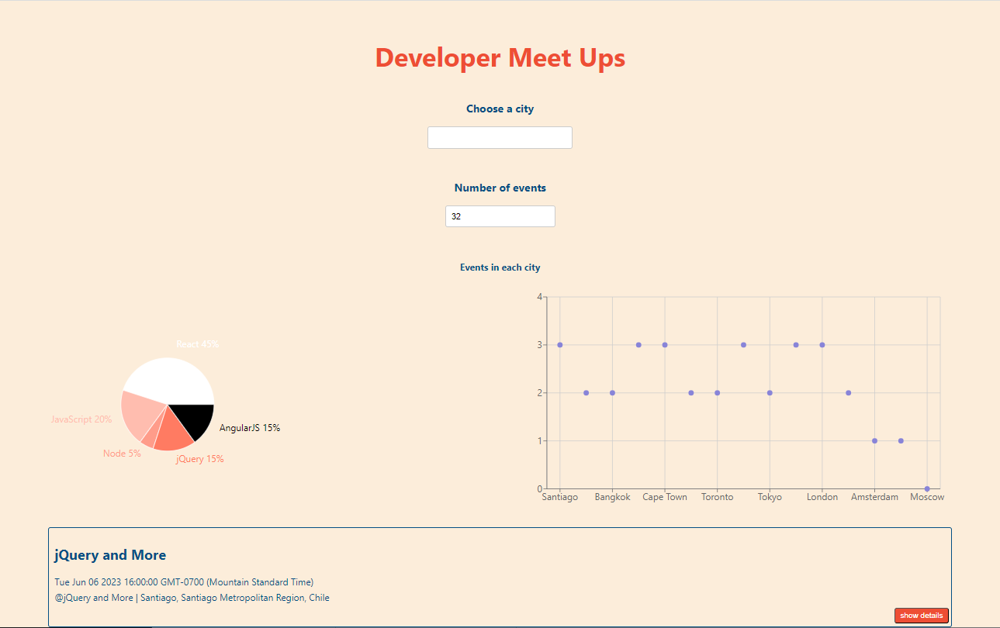

# meetApp

## Overview

meetApp is a test-driven development progressive web app that helps users research, schedule, and attend events in their city. It uses the Google Calendar API and a serverless backend powered by AWS Lambda to retrieve upcoming events and handle access authorization. The app is still under construction.

## Links

-   [Live site URL](https://calebcochranebil.github.io/meet/)
-   [Code URL](https://github.com/Calebcochranebil/meet)

## Serverless Functions

-   In the Meet app, I'll be able to utilize serverless functions to handle real-time messaging, user authentication and authorization, and API endpoints. This will free up time to focus on the essential app features and will allow me to rapidly develop and deploy new ones. By leveraging serverless technology, I can scale the app to handle sudden increases in traffic while keeping our operational costs low. Overall, the Meet app's backend infrastructure relies heavily on serverless functions to provide a secure and user-friendly experience for my users.

### Technologies Used

-   Create React App
-   React

## Features

**FEATURE 2: SHOW/HIDE AN EVENT'S DETAILS**

**User story**

As a user, I should be able to show/hide an event's details, So that I can see more or less information about the event.

**Scenarios**

Scenario 1: An event element is collapsed by default.

Given the user is on the events page When they view an event element Then they should see that the details are collapsed by default

Scenario 2: User can expand an event to see its details.

Given the user is on the events page And an event element is collapsed When the user clicks on the event element Then the details of the event should be expanded

Scenario 3: User can collapse an event to hide its details

Given the user is on the events page And an event element is expanded When the user clicks on the event element Then the details of the event should be collapsed

**FEATURE 3: SPECIFY NUMBER OF EVENTS**

**User story**

As a user, I should be able to specify the number of events I want to see, So that I can customize my event viewing experience.

**Scenarios**

Scenario 1: When the user hasn't specified a number, 32 is the default number

Given the user is on the events page When the page loads Then the user should see up to 32 events displayed

Scenario 2: User can change the number of events they want to see

Given the user is on the events page When they change the number of events to be displayed Then the page should reload to display the new number of events

**FEATURE 4: USE THE APP WHEN OFFLINE**

**User story**

As a user, I should be able to use the app when offline, So that I can still access event information even without an internet connection.

**Scenarios**

Scenario 1: Show cached data when there's no internet connection

Given the user has previously loaded the events page with an internet connection When the user loses their internet connection Then the app should show the cached events data

Scenario 2: Show error when the user changes the settings (city, time range)

Given the user has changed the settings for the events page When the user loses their internet connection Then the app should show an error message indicating that the user cannot change the settings without an internet connection.

**FEATURE 5: DATA VISUALIZATION**

**User story**

As a user, I should be able to see data visualization in the form of a chart, So that I can easily compare the number of upcoming events in different cities.

**Scenarios**

Scenario 1: Show a chart with the number of upcoming events in each city

Given the user is on the events page When they view the chart Then they should see a chart displaying the number of upcoming events in each city.
